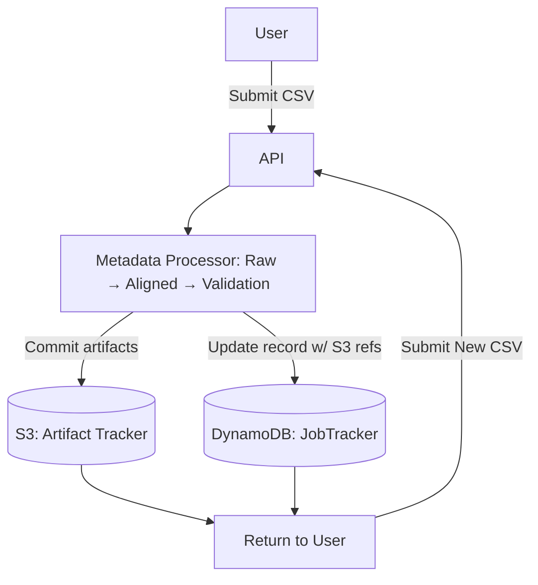

```mermaid
graph TD
  U[User] -->|Submit CSV| API[API]

  %% Processing pipeline
  API --> P[Metadata Processor: Raw → Aligned → Validation]

  %% Commit step
  P -->|Commit artifacts| S3[(S3: Artifact Tracker)]
  P -->|Update record w/ S3 refs| DDB[(DynamoDB: JobTracker)]

  %% Return flow
  S3 --> RET[Return to User]
  DDB --> RET
  RET -->|Submit New CSV| API

```
